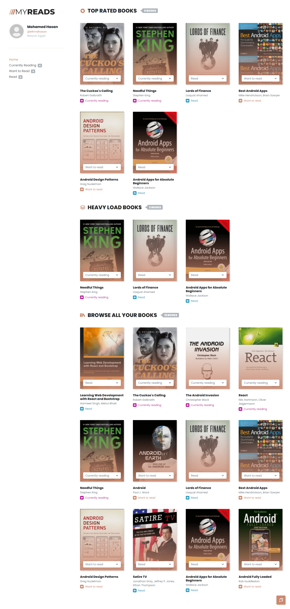
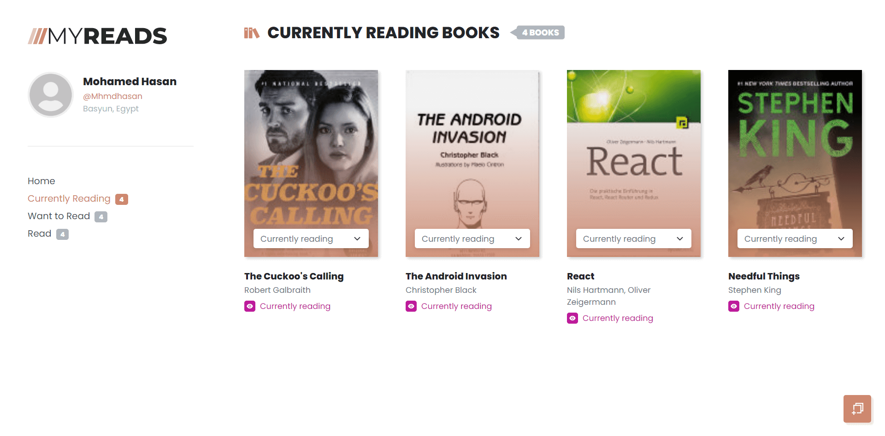
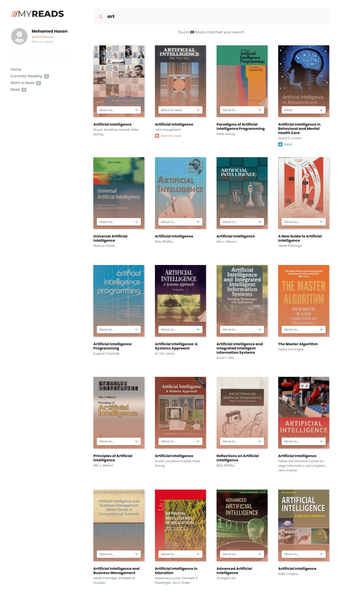

# My Reads Project

MyReads is a webapp to organize books into categories: 'read', 'want to read' and 'currently reading'. Books are looked up from in a public database through a 'search' function.

## Table of content

-   [Overview](#overview)
-   [How to run the project](#how-to-run-the-project)
-   [App Functionality](#app-functionality)
-   [Screenshots](#screenshots)
-   [Credits & Resources ](#credits-&-resources)

## Overview

This app is built with functional components, managing state using the mix of **useContext** and **useReducer** React Hooks, as a starting point, I was given a starter static template without any of the React code that was needed to complete the project. My job was be to add interactivity to the app by refactoring the static code in this template.

## How to run the project

To run the project, download or clone the repository in your computer:

    $ git clone https://github.com/mhmdhasan/react-myreads.git

and follow the instructions below.

In the repository folder: 
* install all project dependencies with 

        npm install
* start the development server with 

        npm start

Please note that the backend server -against which the web app was developped- was provided by Udacity. I transformed the provided methods exist in [`BooksAPI.js`](src/BooksAPI.js) file to fit the new way I've developed this app, the new methods placed at [`app_context.js`](src/context/app_context.js) and they are as following

* `getAll` => `fetchBooks`
* `search` => `searchBooks`
* `update` => `update`

## App functionality

In this app, the main page displays all the picked books, organized differently by two categories [Top rated books, Large books], as well as listing of all books. The leftside sidebar holds all the pages exist: 

* Home
* Currently Reading
* Want to read
* Read

All app pages -apart from search page- contains an anchor leads to the search pages, from the search page you can redirect to any page through the sidebar menu.

The search page has a text input field that may be used to find books. As the value of the text input changes, the books that match that query are displayed on the corresponding shelf page, along with a control that lets the user add the book to their library, they're outlined with their updated shelfs on the homepage too. 

The backend API uses a fixed set of cached search results and is limited to a particular set of search terms, which can be found in [**SEARCH_TERMS.md**](SEARCH_TERMS.md). That list of terms are the **only terms** that will work with the backend, so don't be surprised if your searches for Basket Weaving or Bubble Wrap don't come back with any results.

## Screenshots

* A screenshot of the web app home page: 

* A screenshot of a shelf page, all shelf pages share the same structure: 

* A screenshot of the web app search page; showing books that appear when searching for "Art". 

## Credits & Resources

- [Create-react-app Documentation](https://github.com/facebookincubator/create-react-app)
- [React Router Documentation](http://knowbody.github.io/react-router-docs/)
- [React Training/React Router](https://reacttraining.com/react-router/web/api/BrowserRouter)
- [React Icons](https://react-icons.github.io/react-icons).

